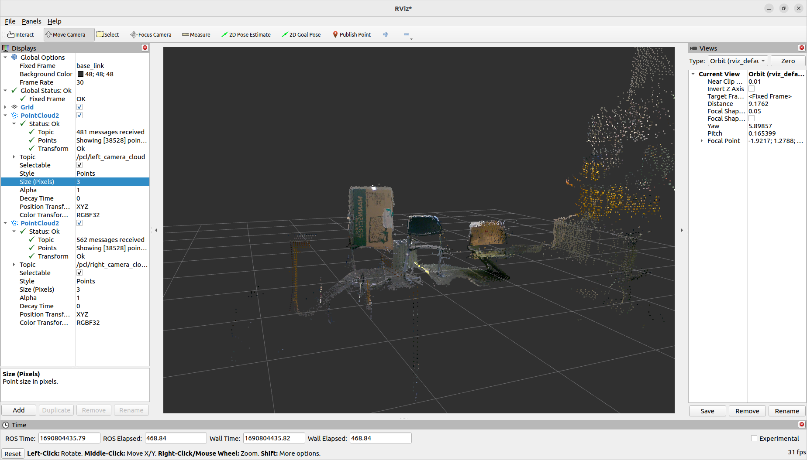
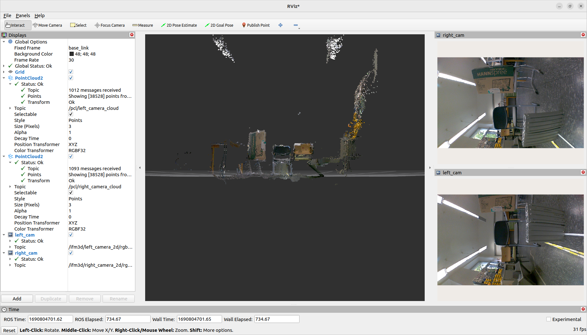

# O3R Colored Pointcloud

This package allows user to visualize 3D colored pointcloud using ifm O3R camera system.

## Supported hardware

|  Name | Type  |
| ------------ | ------------ |
|  OVP800 | Video Processing Unit (VPU)  |
|  O3R225 | 3D camera  |


## Requirements

- ROS 2 distribution:- Humble
- ifm3d library ( [version = v1.3.3](https://github.com/ifm/ifm3d/releases/tag/v1.3.3 "version = v1.3.3") )
- ifm3d-ros2 wrapper ( [version = v1.1.0](https://github.com/ifm/ifm3d-ros2/releases/tag/v1.1.0 "version = v1.1.0") )

*Further instructions to install*

- ROS2 Humble: [https://docs.ros.org/en/humble/Installation.html](https://docs.ros.org/en/humble/Installation.html "https://docs.ros.org/en/humble/Installation.html")
- ifm packages: [https://api.ifm3d.com/stable/content/installation_instructions/install_linux_binary.html](https://api.ifm3d.com/stable/content/installation_instructions/install_linux_binary.html "https://api.ifm3d.com/stable/content/installation_instructions/install_linux_binary.html")
- Actions file available in the repository.

## Camera connections

O3Rxxx has 2 outputs, 2D-Image and 3D-Data. 

**When using 1 Camera, connect it to the following ports:**

|  Port Name | Camera Output  |
| ------------ | ------------ |
| Port 0  | 2D-Image  |
| Port 2  | 3D-Data  |

**When using 2 Cameras, connect it to the following ports:**

|  Port Name | Camera 1 Output  | Camera 2 Output  |
| ------------ | ------------ | ------------  |
| Port 0  | 2D-Image  | ------------  |
| Port 2  | 3D-Data  | ------------  |
| ------------  | ------------  | ------------  |
| Port 1  | ------------  | 2D-Image  |
| Port 3  | ------------  | 3D-Data  |

Rest of the configuration is set to default as provided by ifm and also available on their website. There is a config folder which has required parameters pre-configured.


## Building package

1. Clone this repository to ros_ws/src. (Preferable in the same location as ifm3d-ros2 package)

2. Open ros_ws in termanal and run the following:

	```bash
	rosdep update
	rosdep install -y -r -q --from-paths src --ignore-src --rosdistro humble
	```

3. Build ROS (2) package: o3r_ros2

   ```bash
   colcon build --packages-select o3r_ros2
   ```

4. There are following launch files availble to test:

|  Name | Description  | Command  |
| ------------ | ------------ | ------------ |
| example_o3r_2d_and_3d_launch  |  Example file to run 1 camera. | ros2 launch o3r_ros2 example_o3r_2d_and_3d_launch.py  |
| example_two_o3r_heads_launch  |  Example file to run 2 cameras. |  ros2 launch o3r_ros2 example_two_o3r_heads_launch.py |

5. Use RVIZ2 to visualize TFs and robot model

### Available Launch file parameters

| Param Name  | Default value  | Options  | Description |
| ------------ | ------------ | ------------ | ------------ |
| uncompressed  | false | true, false | Flag to enable subscription to uncompressed image |
| timer_period  | 0.5 | double value | Colored pointcloud stream speed.  |

### Tips

When running two cameras, use the following static transforms to visualise. 

Replace (distance_from_mid_point_between_cameras) and (height_from_ground):

```bash
ros2 run tf2_ros static_transform_publisher --frame-id base_link --child-frame-id right_camera_3d_optical_link --y -(distance_from_mid_point_between_cameras) --pitch 1.57 --z (height_from_ground)

ros2 run tf2_ros static_transform_publisher --frame-id base_link --child-frame-id left_camera_3d_optical_link --y (distance_from_mid_point_between_cameras) --pitch 1.57 --z (height_from_ground)
```


## Sample image


